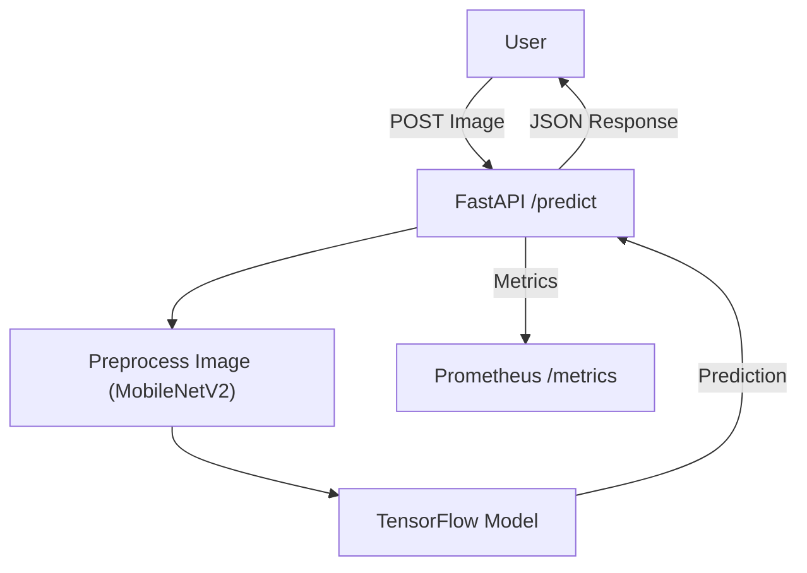
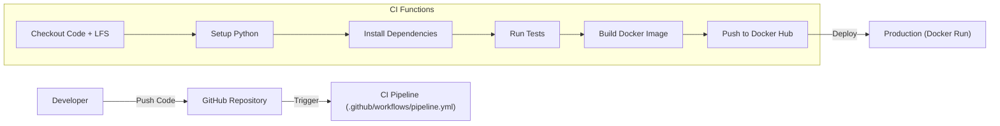

# 🐱 vs 🐶 MLOps Classification Pipeline


## 📖 Executive Summary
This project implements a robust, end-to-end **MLOps pipeline** for binary image classification (Cats vs Dogs). It demonstrates industry best practices by integrating:
- **Transfer Learning** with MobileNetV2 for high-accuracy training.
- **Experiment Tracking** using MLflow.
- **Automated CI/CD** with GitHub Actions for testing and deployment.
- **Containerization** via Docker for consistent environments.
- **Observability** with Prometheus metrics and structured logging.

The system is designed to be **production-ready**, scalable, and easily maintainable.

---

## 🏗️ Architecture

### 🔄 Application Flow
The application follows a standard inference pattern:
1.  **User** sends an image to the API.
2.  **FastAPI** validates and pre-processes the image (MobileNetV2 standard).
3.  **TensorFlow Model** runs inference.
4.  **Prometheus** collects request latency and count metrics.



### 🚀 CI/CD Pipeline
Every push to `main` triggers the automated pipeline:
1.  **checkout**: Retrieves code and LFS artifacts (`model.h5`).
2.  **test**: Runs `pytest` for code quality and integration checks.
3.  **build**: Creates a Docker image containing the application and model.
4.  **deploy**: Pushes the image to Docker Hub (if secrets are present).



---

## 🛠️ Tech Stack

| Category | Technology | Description |
| :--- | :--- | :--- |
| **Language** | Python 3.11 | Core programming language. |
| **API** | FastAPI | High-performance async web framework. |
| **ML Engine** | TensorFlow / Keras | MobileNetV2 (Transfer Learning). |
| **Tracking** | MLflow | Logs parameters, metrics, and artifacts. |
| **Container** | Docker | Distroless/Slim images for production. |
| **CI/CD** | GitHub Actions | Automated testing and delivery. |
| **Monitoring** | Prometheus | Real-time metrics scraping. |
| **Version Control** | Git LFS | Large File Storage for `*.h5` models. |

---

## 📂 Project Structure

```bash
c:/dev/mlops
├── .github/workflows/    # 🤖 CI/CD definitions
├── app/                  # 🚀 FastAPI application
│   ├── main.py           #    - API Endpoints & Monitoring
├── src/                  # 🧠 ML Source Code
│   ├── train.py          #    - Training loop & Callbacks
│   ├── model.py          #    - MobileNetV2 Architecture
│   ├── preprocess.py     #    - Data Augmentation & Prep
├── tests/                # 🧪 Unit & Integration Tests
├── Dockerfile            # 🐳 Production Docker Image
├── docker-compose.yml    # 📦 Orchestration
├── requirements.txt      # 📦 Python Dependencies
├── smoke_test.py         # 🔍 Post-deployment Health Check
└── README.md             # 📄 Documentation
```

---

## 🚀 Setup & Installation

### Prerequisites
- Python 3.9+
- Docker & Docker Compose
- Git with **Git LFS** installed (`git lfs install`)

### 1. Clone & Configure
```bash
git clone <your-repo-url>
cd mlops
git lfs pull  # Download model artifacts
```

### 2. Local Environment
```bash
# Create virtual environment
python -m venv venv
source venv/bin/activate  # Windows: venv\Scripts\activate

# Install dependencies
pip install -r requirements.txt
```

### 3. Prepare Data
Download the [Kaggle Cats & Dogs Dataset](https://www.kaggle.com/c/dogs-vs-cats/data) and structure it as:
```text
Dataset/PetImages/
    ├── Cat/  [...images...]
    └── Dog/  [...images...]
```

---

## 🧠 Model Training

To retrain the model with new data or hyperparameters:

```bash
python -m src.train
```
- **Output**: Generates `model.h5` (Best Model) in the root directory.
- **Logging**: Metrics are logged to local MLflow (`mlruns/`).

**Key Features**:
- **EarlyStopping**: Prevents overfitting.
- **ReduceLROnPlateau**: Optimizes convergence.
- **ModelCheckpoint**: Saves only the best performing model.

---

## 🐳 Deployment (Docker)

### Build & Run Locally
```bash
docker-compose up --build -d
```

### Run Production Image
Pull the pre-built image from Docker Hub (updated via CI/CD):
```bash
docker run -p 8000:8000 msanthoshofficial/cat-dog-classifier:latest
```

### Verification
Run the smoke test to ensure the API, Model, and Metrics are healthy:
```bash
python smoke_test.py
```

---

## 🔌 API Documentation

### `POST /predict`
Classifies an uploaded image.

**Request**: `multipart/form-data`
- `file`: Image file (jpg, png)

**Response**:
```json
{
    "prediction": "Dog",
    "confidence": 0.98,
    "raw_score": 0.9845
}
```

### `GET /metrics`
Prometheus endpoints for observability.
- **request_count**: Total number of inference requests.
- **inference_latency**: Time taken for model prediction.

---

## ⚙️ CI/CD Configuration (GitHub Actions)

The pipeline is defined in `.github/workflows/pipeline.yml`.

### Secrets Required
To enable Docker Hub pushing, add these **Repository Secrets**:
- `DOCKER_USERNAME`
- `DOCKER_PASSWORD`

### Workflow Steps
1.  **LFS Checkout**: Ensures the 15MB+ model file is available.
2.  **Pytest**: Runs unit tests (if any) and checks file integrity.
3.  **Docker Build**: Uses `python:3.11-slim` for a small footprint.
4.  **Push**: Tags with `latest` and pushes to Docker Hub.

---

## 📊 Monitoring

The application is instrumented with `prometheus-fastapi-instrumentator`.

1.  **View Metrics**: Navigate to `http://localhost:8000/metrics`.
2.  **Integration**: Configure a Prometheus server to scrape this target:
    ```yaml
    scrape_configs:
      - job_name: 'mlops-app'
        static_configs:
          - targets: ['host.docker.internal:8000']
    ```

---

## 🤝 Contribution

1.  Fork the repository.
2.  Create a feature branch (`git checkout -b feature/amazing-feature`).
3.  Commit your changes.
4.  Push to the branch.
5.  Open a Pull Request.

---

## 📜 License

Distributed under the MIT License. See `LICENSE` for more information.
